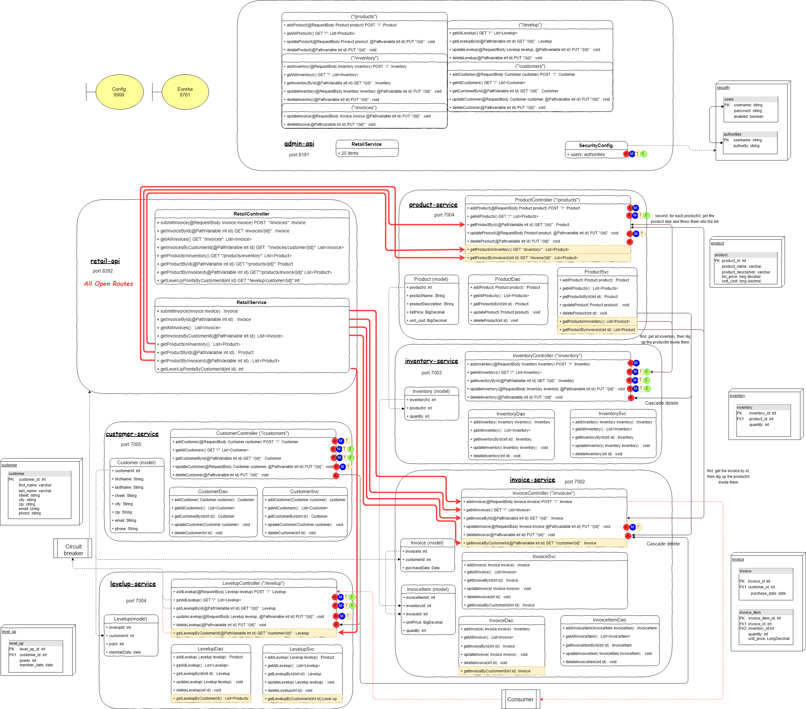

# MondiraRoyCapstone
Game shop revisited

## Objective
This set of REST APIs will support both web and mobile clients for customers. The original design is a traditional monolithic application with a single database. This project is to move the current design and partial implementation to a design that follows the  new cloud-native architectural standards

## Tasks
* Manage your project using Pivotal Tracker
* Use Test-Drive Development (TDD) 
* Design the backing services losely coupled to Retail and Admin Api 
* Use Spring security, Queue, Circuit breaker, feign clients, config server and eureka service registry.
* All configuration are stored in repo: https://github.com/Simonkcoding/capstone2-cloud-config

## Outline

## Features and Functional Requirements

This section contains all of the functional requirements of the system.

### Retail API Service

##### Port

This service runs on port 8181.

##### API

The Retail API is a BFF edge service that contains all API endpoints for searching inventory and purchasing products. This API does not require authentication. This API is not documented. You must pull all of the inventory search and product purchasing endpoint from the existing code, document them in Swagger, and reimplement them in the new Retail API Service.

##### Backing Services

The Retail API Service communicates with the following backing services:

* Level Up
* Order
* Inventory
* Product
* Customer

##### Business Rules

* 10 Level Up points are awarded for each $50 purchased.
* These points are not pro-rated.
  * For example:
    * A $49 order gets zero Level Up points.
    * A $99 order gets 10 Level Up points.
    * A $110 order gets 20 Level Up points.
* Level Up points are submitted when the order is submitted.
* Level Up points totals are returned as part of the completed invoice.
* Order quantity must be greater than zero and less than or equal to the number of items in inventory.
* Orders must contain valid products.
* An order must contain a valid customer.

##### Architecture Requirements

* Level Up points must be submitted to the Level Up service via a queue.
* Level Up total inquiries must be run through a circuit breaker.
* See diagram above.

### Admin API

##### Port

This service runs on port 8282.

##### API

The Admin API is a BFF edge service that contains all the endpoints for CRUD operations of the following:

* Customers
* Products
* Inventory
* Orders
* Level Up Points

This API is not documented and is only partially implemented in the existing code. You must pull out the parts of the API that are implemented in the existing code, model them in Swagger, and reimplement them in the new Admin API service. Use the existing API endpoints as a model for the missing endpoints.

##### Security Rules

The security rules for the Admin API Service are:

* All Admin API endpoints require authentication.
* Admin Role
  * Can access all endpoints.
* Manager Role
  * Can Create, Read, and Update all items in the system.
* Team Lead Role
  * Can Read and Update all items in the system.
  * Can Create Customers in the system.
* Employee Role
  * Can read all items in the system.
  * Can Update Inventory in the system.

### Level Up Service

##### Port

This service runs on port 7001.

##### Description

This is a microservice that contains all CRUD functionality for the Level Up! rewards system. This service has not been designed. You must design and document the API and implement the entire service.

The Read endpoint of the service must have a circuit breaker.

### Invoice Service

##### Port

This service runs on port 7002.

##### Description

This is a microservice that contains all CRUD functionality for Invoices. This service has not been designed, but a shell implementation of the CRUD endoints for Invoices is in the existing code. Find these endpoints, document the endpoints in Swagger and reimplement them in the new Invoice microservice.

### Inventory Service

##### Port

This service runs on port 7003.

##### Description

This is a microservice that contains all CRUD functionality for inventory. This service has not been designed. You must design and document the API and implement the entire service.

### Product Service

##### Port

This service runs on port 7004.

##### Description

This is a microservice that contains all the CRUD functionality for Products. This service contains information on all the Products that the company has sold in the past and may sell in the future. This service does not contain information about current inventory levels. This service has not been designed. you must design and document the API and implement the entire service.

### Customer Service

##### Port

This service runs on port 7005.

##### Description

This is a microservice that contains all the CRUD functionality for Customers. This service has not been designed. you must design and document the API and implement the entire service.

### Configuration Server

##### Port

This service runs on port 9999.

### Service Registry

##### Port

This service runs on port 8761.

## Architectural Requirements

This section contains all of the architectural requirements of the system.

### Configuration Server

All services in the system must use the Configuration Server for all of their configuration files.

### Service Registry

All backing services must register with the Service Registry. The Retail API and Admin API web services must use the Service Registry to locate the backing services that they use.

### Spring Security

The Admin API must be protected by Spring Security (roles and access rules are found in the Functional Requirements above).

* You must use the default Spring Security schema.
* All passwords must be hashed with BCrypt

### Interaction with Backing Services

Communication to backing services from the Retail API and Admin API web services must be done using Feign clients in a Service Layer component.

### Database Interaction

All DAOs must use JdbcTemplates and Prepared Statements.

### Caching

You must incorporate caching as appropriate in the application. Be prepared to explain your design decisions.

### Error Handling

* You must implement ControllerAdvice to handle exceptions and return propery HTTP status codes and data when exception occur. This includes handling all violoations of business rules.
* You must use JSR 303 validation where appropriate
